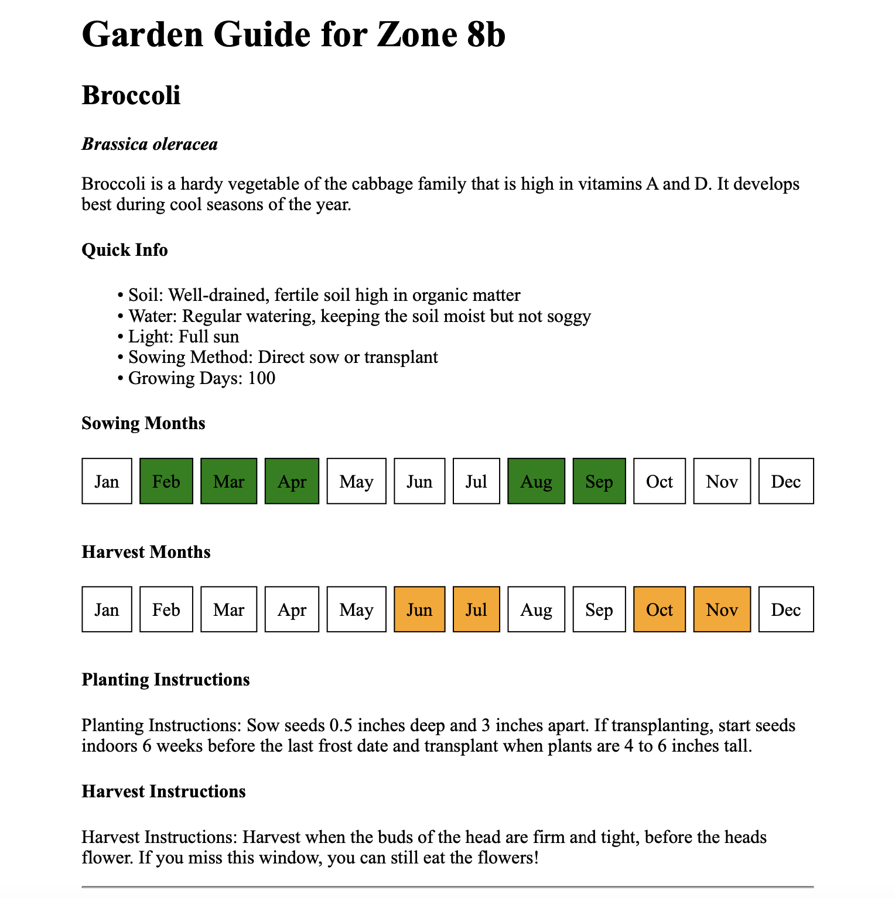

# Garden Guide Generator

## Summary
This tool calls GPT-4 to generate a PDF/HTML guide for growing your food this year.

Data delivered includes growing requirements (soil, water, light), planting and harvest months, as well as instructions.

## Installation

You need access to OopenAI model `gpt4-0613` or newer via your API key.

```
python3 -m venv env
source env/bin/activate
pip install -r requirements.txt
export OPENAI_API_KEY="sk-yourkeyhere".
```

## Usage

```
python garden_planner.py <zone> <plants,comma,sep,list>
```

Example:

```
source env/bin/activate
python garden_planner.py 8b broccoli,spinach,pumpkins,oregano
```

## Example Output

